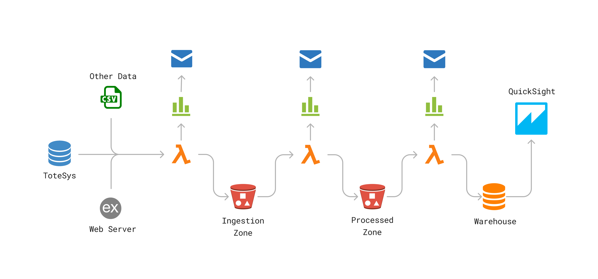

# The AWSome Project

## Introduction
The purpose of this project is to create a data platform that extracts data from an operational database named **ToteSys**, archives it in a data lake, and makes it available in a remodelled OLAP data warehouse hosted in Amazon Web Services (AWS). 

Deployment of AWS resources via Terraform is automated using GitHub Actions and credentials are stored as secrets to ensure that confidentiality is maintained.

---

## ETL Infrastructure



### Extraction Phase
A Python application deployed in AWS Lambda (hereinafter called "The Ingest Lambda") ingests all tables from the ToteSys database and stores them in an Amazon S3 bucket called **nc-de-awsome-ingestion-zone**. The Ingest Lambda runs on a schedule every 10 minutes according to an Amazon EventBridge rule and logs its progress to Amazon CloudWatch. Email alerts are triggered by using Amazon Simple Notification Service (SNS) in the event of errors.

### Transformation Phase
A second Python application (hereinafter called "The Process Lambda") uses the ingested tables to populate the fact and dimension tables of the three star schemas. The Process Lambda saves these remodelled tables in parquet format in a separate S3 bucket called **nc-de-awsome-processed-zone**. The Process Lambda is automatically triggered when the Ingest Lambda creates a file on completion named `query_log.json` in the ingestion zone bucket. Progress is logged to Amazon CloudWatch, and email alerts are triggered in the event of errors.

### Load Phase
A third and final Python application (hereinafter called "The Load Lambda") loads the processed data into a prepared data warehouse. The Load Lambda is automatically triggered when the Process Lambda creates a file on completion named `query_log.json` in the processed zone bucket. Progress is logged to Amazon CloudWatch, and email alerts are triggered in the event of errors.

---

## Setup Instructions

1. Fork and clone this repository.
2. In the terminal, set up the AWS CLI by running the following command:

   ```bash
   aws configure
   ```

3. Navigate to the root directory of the project and run:

   ```bash
   sh setup.sh
   ```

   This creates a virtual environment and activates it, installs all the required dependencies, and runs all checks (i.e., security test, flake8 code check, and unit tests).

4. Activate the virtual environment by running the following commands:

   ```bash
   python -m venv venv
   source venv/bin/activate
   ```

5. Still from the root directory of the project, run the following command:

   ```bash
   sh state.sh
   ```

   This creates a bucket called **nc-de-awsome-state** in AWS S3 that will store the Terraform state file remotely.

6. Finally, run the following command from the root directory of the project to create the deployment packages (.zip files) for each of the Lambda functions:

   ```bash
   sh deploy.sh
   ```

   *Note:* Since the process of creating these packages has been integrated as part of the CI/CD pipeline, this final step is **only** necessary when deploying via Terraform on a local machine (see below).

---

## Terraform
To deploy the AWS resources using Terraform, move into the `terraform` directory, where all the .tf files live, then run the following commands in succession:

```bash
terraform init
# Prepares the working directory so Terraform can run the configuration

terraform plan
# Previews the actions Terraform would take to modify your infrastructure

terraform apply
# Executes the actions proposed in a Terraform plan to create, update, or destroy resources
```

The following command will take down the deployment and terraform infrastructure:

```bash
terraform destroy
# Destroys the project infrastructure and frees up the allocated resources
```

